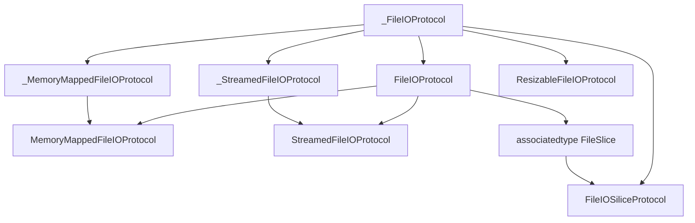

# FileIO

A Swift library for reading and writing files.

<!-- # Badges -->

## Features

- [MemoryMappedFile](./Sources/FileIO/MemoryMappedFile.swift): using mmap
- [StreamedFile](./Sources/FileIO/StreamedFile.swift): using FileHandle (syscall)

- [ConcatenatedMemoryMappedFile](./Sources/FileIO/ConcatenatedMemoryMappedFile.swift): using mmap. Treats multiple files as one continuous virtual file.
- [StreamedFile](./Sources/FileIO/ConcatenatedStreamedFile.swift): using FileHandle (syscall). Treats multiple files as one continuous virtual file.

## Usage

MemoryMappedFile/StreamedFile have the same API available for both.

Available methods are defined in the [FileIOProtocol](./Sources/FileIO/FileIO.swift)

## Design Overview

This library separates file I/O into three orthogonal concerns:

1. Capability: what operations are supported (`_FileIOProtocol`)
2. Role: how the object is used (`FileIOProtocol`, `FileIOSiliceProtocol`)
3. Implementation strategy: how I/O is performed (memory-mapped or streamed)

### Protocol Relationships

The following diagram illustrates the relationships between the core protocols in this library.

- `_FileIOProtocol` defines the fundamental read/write and synchronization operations.
- `FileIOProtocol` extends it with file-opening and slicing capabilities.
- `FileIOSiliceProtocol` represents a logical view into a file with a `baseOffset`.
- `ResizableFileIOProtocol` adds structural mutation operations such as insert and delete.
- `_MemoryMappedFileIOProtocol` and `_StreamedFileIOProtocol` describe low-level implementation traits.
- `MemoryMappedFileIOProtocol` and `StreamedFileIOProtocol` combine implementation traits with `FileIOProtocol`.

## License

FileIO is released under the MIT License. See [LICENSE](./LICENSE)
